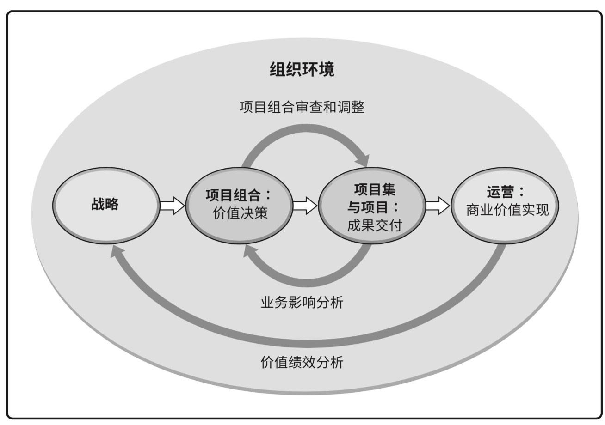

## 第一次作业
*17343101 苏祺达*

---

1. > 讨论 projects、programs、和 portfolio 之间的关系以及对企业成功的贡献;以及与operations以及OPM之间的关系。  
  
    * projects（项目）：项目是为创造独特的产品、服务或成果而进行的临时性工作。
    * programs（项目集）：项目集是一组相互关联且被协调管理的项目、子项目集和项目集活动，以便获得分别管理所无法获得的利益。
    * portfolio（项目组合）：项目组合是指为实现战略目标而组合在一起管理的项目、项目集、子项目组合和运营工作。
    * 以上三者的关系示意：
        ```dot
          digraph {
            rankdir=tb;
            proj1[shape=rectangular; label=项目];
            proj2[shape=rectangular; label=项目];
            proj3[shape=rectangular; label=项目];
            proj4[shape=rectangular; label=项目];
            proj5[shape=rectangular; label=项目];
            proj6[shape=rectangular; label=项目];
            prog1[shape=rectangular; label=项目集];
            prog2[shape=rectangular; label=项目集];
            prog3[shape=rectangular; label=项目集];
            port[shape=rectangular; label=项目组合];
            port -> prog1;
            port -> proj1;
            port -> prog2;
            prog1 -> proj2;
            prog1 -> proj3;
            prog2 -> proj4;
            prog2 -> prog3;
            prog3 -> proj5;
            prog3 -> proj6;
          } 
        ```
    * operation（运营）：运营管理关注产品的持续生产和(或)服务的持续运作。它使用最优资源满足客户要求，来保证业务运作的持续高效。它重点管理那些把各种输入(如材料、零件、能源和劳力)转变为输出(如产品、商品和(或)服务)的过程。
    * OPM（组织级项目管理）：项目组织管理指为实现战略目标而整合项目组合、项目集和项目管理与组织驱动因素的框架。
    * 以上术语的关系示意：
        