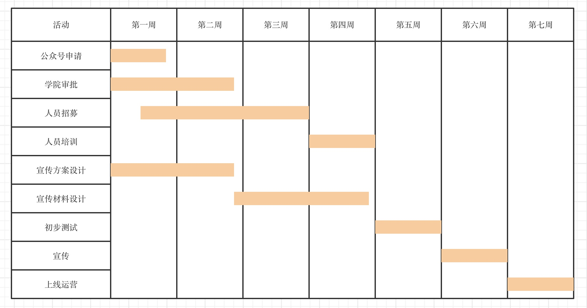

# 分析与工具
*17343101 苏祺达*

---
1. 你联合同学做一个年级微信公众号加强各班相互了解、联合活动等。请编制项目章程和项目管理计划，指导该项目实施与运营。 必须包含 WBS 和 甘特图;
    * 项目章程
        * 项目启动日期：2020年7月1日
        * 项目目的：通过发布各班活动，加强各班相互了解，促进各班联合活动的展开。
        * 可测量的项目目标和相关的成功标准：
            1. 交流平台和信息发布平台基本建成：接到投稿时能在24小时内审核整理并决定是否发布，如果决定发布，需要在48小时内发布；每周有固定推送内容反映各班活动状况。
            1. 累积一定的用户：活动投稿阅读量达到年级人数的四分之一以上；周常推送阅读量达到50。
        * 高层级需求：成功实现各班活动相互通知，各班同学互相了解并互相促进。
        * 整体项目风险
            1. 微信公众号无法获得学院官方认可。
            1. 目前的消息推送渠道众多，在网络上，有学院、团委、学生会等公众号，在现实中，有公告版和摆摊等方式，该项目有可能无法弥补目前的空缺。
            1. 宣传力度不够使得公众号接受不到投稿且没有人使用
        * 总体里程碑进度计划
            1. 第一周前，完成公众号申请。
            1. 第二周前，完成向学院申请审批及宣传方案设计。
            1. 第三周前，完成推送撰写人员和投稿处理人员的招募。
            1. 第四周前，完成宣传材料设计及人员培训。
            1. 第五周前，公众号上线进行初步测试。
            1. 第六周前，完成向各班进行宣传。
            1. 第七周前，公众号正式上线运营。
    * 项目管理计划
        * WBS:
            ```dot
            graph {
              rankdir=LR;
              node[shape=rectagle];
              公众号建立 -- 申请及审批
              公众号建立 -- 人员招募
              公众号建立 -- 宣传
              公众号建立 -- 测试及运营
              申请及审批 -- 申请开通组织公众号
              申请及审批 -- 从学院出获得运营许可
              人员招募 -- 推送撰写人员招募
              人员招募 -- 投稿处理人员
              人员招募 -- 人员培训
              宣传 -- 宣传方式设计
              宣传 -- 宣传材料设计
              宣传 -- 执行宣传
            }
            ```
        * 甘特图
            

1. 请根据教材 HYM 公司案例(教材第四章 Running Case)，选择并 完成其中一个任务
    休闲与健康网站的分项目章程：
        * 项目启动日期：2020年7月1日
        * 项目目的：节约员工医疗保险费用
        * 可测量的项目目标和相关的成功标准：四年内员工的保险费用降低30%
        * 整体项目风险
            1. 激励力度不够，员工不积极参与活动
            1. 激励力度过大，导致激励成本大于实际回报
            1. 员工在活动过程中会产生的意外事故
            1. 保险商不同意
        * 总体里程碑进度计划
            1. 第一个月内提出第一个文娱节目的策划
            1. 两个月内建成应用并上线测试
            1. 第三个月内执行第一个文娱节目
            1. 第六个月内完成收集员工数据的完整收集
            1. 第九个月内完成与保险商的谈判