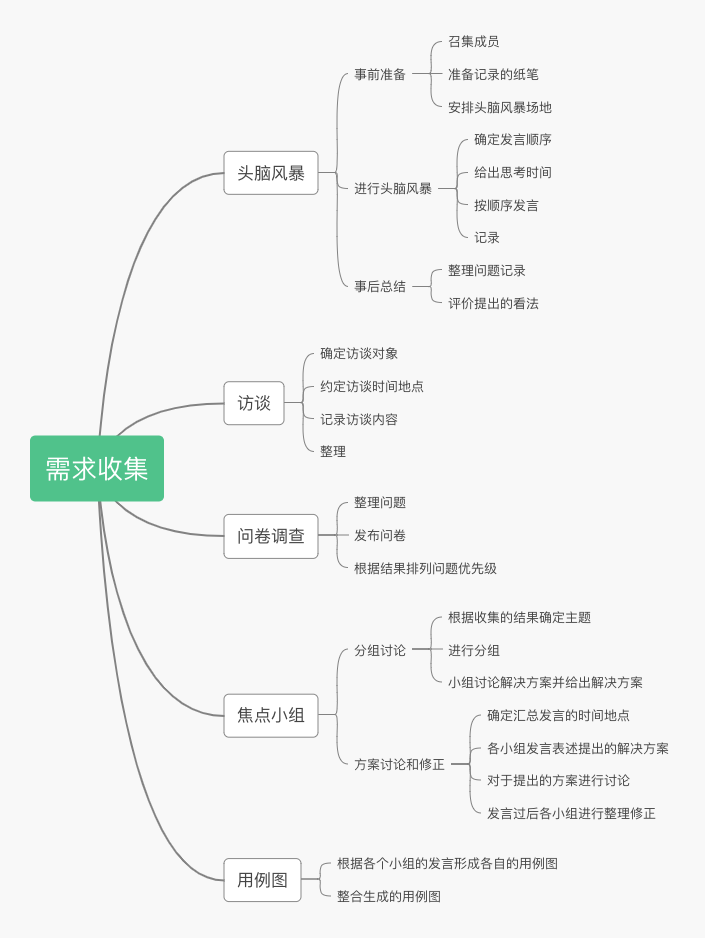

# 分析与工具
*17343101 苏祺达*

---
1. 你联合同学做一个年级微信公众号加强各班相互了解、联合活动等。请写一份两页的报告，描述收集需求的方法，并附上收集的需求跟踪矩阵(不少于五个需求)

    1. 需求收集方法：
        * 头脑风暴：召集项目组所有成员进行讨论，寻找目前在班级间沟通中存在的问题和解决方式，挖掘公众号可以做的内容。只记录看法，不进行评价。
        * 访谈：对各班负责各个事务的成员进行一对一访谈，找出未被普通参与的同学发现的痛点。
        * 问卷调查：结合上述两点得到的问题，制成问卷，寻找哪些需求是最得到关注和最亟待解决的。
        * 焦点小组：通过问卷调查得出的结论，选取几个备受关注的问题，成立焦点小组，研讨如何解决这些问题。
        * 用例图：根据焦点小组讨论的结果，生成用例图图，综合并制作成为完善的需求。
    1. 需求跟踪矩阵

        |>|>|>|>|>|需求跟踪矩阵|
        |-|-|-|-|-|-|-|-|-|
        |项目名称|>|>|>|>|“年级通”公众号|
        |项目描述|>|>|>|>|加强各班相互了解、发布联合活动的公众号|
        |标识|关联标识|需求描述|项目目标|WBS 可交付成果|完成情况|
        |001|1.0|收集各班组织的活动信息并整理转发|建立一个实时活动推送平台，鼓励各班同学参与|接到投稿时能在24小时内审核整理并决定是否发布，如果决定发布，需要在48小时内发布|&emsp;<input type="checkbox">|
        |^|1.2|活动信息查询功能|使用微信公众号的功能，制作根据关键词查找历史消息功能|完成查找功能的搭建|&emsp;<input type="checkbox">|
        |^|1.3|委托发布问卷|接受问卷发布的委托，并做成推送进行转发|接到投稿时能在24小时内审核整理并决定是否发布，如果决定发布，需要在48小时内发布|&emsp;<input type="checkbox">|
        |002|2.1|接收各班同学留言并整理转发|建立一个留言簿，根据留言同学的意愿进行实名或匿名留言，用于提出建议或者转发言论|每天一个留言簿推送，接到留言能够在当天的推送发出之前决定是否发布，并根据留言同学的意愿在指定日期整理并进行发布|&emsp;<input type="checkbox">|
        |003|3.1|每月总结推送|每月制作固定推送内容反映各班活动状况|每月有固定推送内容反映各班活动状况|&emsp;<input type="checkbox">|
1. 使用思维导图，为上述项目构建WBS ，并使用项目管理工具制作WBS或根特图。并按要求检查工作包的可管理性，分解完整性。例如：检查测试、培训等
    